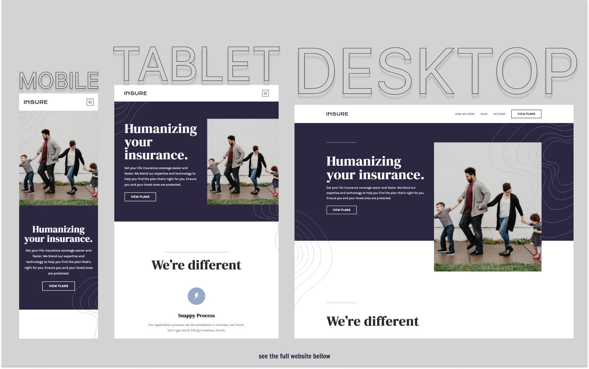

# Frontend Mentor - Insure Landing Page Solution

This is a solution to the [Insure Landing Page Challenge on Frontend Mentor](https://www.frontendmentor.io/challenges/insure-landing-page-uTU68JV8).

## Table of contents

- [Overview](#overview)
  - [The challenge](#the-challenge)
  - [Screenshot](#screenshot)
  - [Links](#links)
- [My process](#my-process)
  - [Built with](#built-with)
  - [What I learned](#what-i-learned)
  - [Continued development](#continued-development)
  - [Useful resources](#useful-resources)
- [Author](#author)

## Overview

### The challenge

Users should be able to:

- View the optimal layout for the site depending on their device's screen size
- See hover states for all interactive elements on the page

### Screenshot

### Links

- Live Site URL: [https://kens-visuals.github.io/insure-landing-page/](https://kens-visuals.github.io/insure-landing-page/)
- Solution URL: [https://www.frontendmentor.io/solutions/insure-landing-page-with-scss-bem-css-animations-and-vanilla-js-tlFb95NjO](https://www.frontendmentor.io/solutions/insure-landing-page-with-scss-bem-css-animations-and-vanilla-js-tlFb95NjO)

## My process

### Built with

- Semantic HTML5 markup
- SCSS custom properties
- CSS Flexbox
- CSS Grid
- CSS animations
- Vanilla JS
- Mobile-first workflow

### What I learned

This project helped me to experiment with some new ideas about layouts. I've experimented with containers and how to position them correctly, so I can control it from a single place. Another thing that I wanted to accomplish with this project was to add some scroll-reveal animations with JS, I was expecting it to be a lot more complex with Vanilla JS. However, it turned out to be a single API called `IntersectionObserver` that will help you to add the stuff. I didn't do anything crazy, but definitely got some practice and had some fun with it. That pretty much was the main goal of this project, and I'm glad how it came out.

### Continued development

For the future project, I'll most certainly implement similar things. Moreover, I'll try to come up with more complex animations and how to achieve them with Vanilla JS. Super excited about this feature and how it can help to make the website come alive.

### Useful resources

- [IntersectionObserver Tutorial](https://www.youtube.com/watch?v=T8EYosX4NOo) - This is a simple tutorial by Kevin Powell about `IntersectionObserver`.
- [IntersectionObserver API Docs](https://developer.mozilla.org/en-US/docs/Web/API/Intersection_Observer_API) - As you guessed from the name this the link to the MDN Docs `forIntersectionObserver API`.

## Author

- Frontend Mentor - [@kens-visuals](https://www.frontendmentor.io/profile/kens-visuals)
- Codewars - [@kens_visuals](https://www.codewars.com/users/kens_visuals)
- CodePen - [@kens-visuals](https://codepen.io/kens-visuals)
